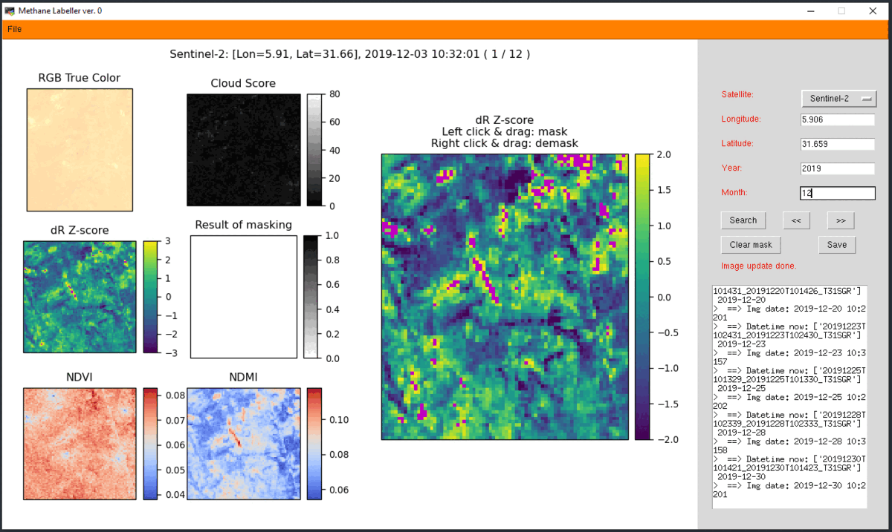
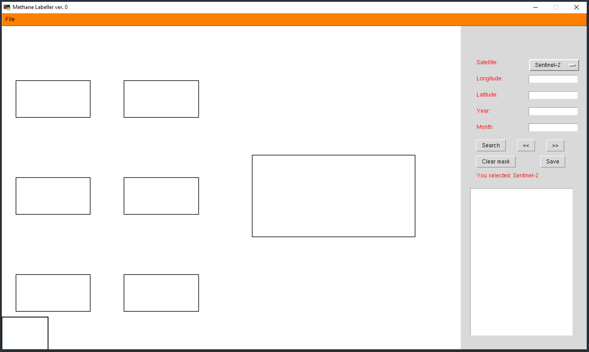
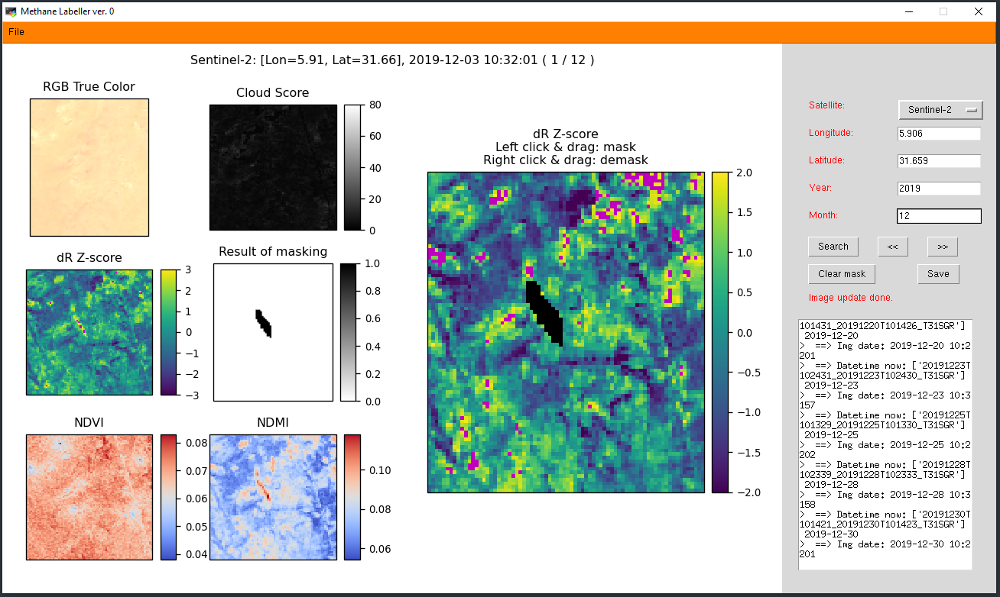

# Methane plume labeller
A GUI for labelling methane plumes from O&G super emitters, using images from Landsat satellites (Landsat 4, 5, 7, and 8) and Sentinel-2.


## Steps to set up the environment
```conda create -n ch4_labeller python=3.10 geemap=0.16.7 earthengine-api tk=8.6.12 matplotlib=3.4.3 cartopy=0.20.3 proplot=0.9 netCDF4 scikit-learn scikit-image ```


## Steps to use the GUI
* Run the GUI: ```python ch4_labeller.py'''. Below is a screenshot of the interface.


* Choose a satellite and provide information about longitude, latitude, year, and month.
* Click search. Satellite images available for the 1-month time window will show up in a few seconds for Landsat data. Searching for Sentinel-2 images takes a longer time due to the higher revisit frequency. Below is a screenshot of the interface after data searching is complete.


* The message box in the bottom-right will show an error message if no images are available for the month. 
* You can use the right arrow (">>") button and left arrow ("<<") to switch between different images. Drawn masks will not be lost due to the switch.
* Click and drag using Left Mouse Button to draw masks over methane plumes. Click and drag using Right Mouse Button to erase.


* Use the "Clear mask" button to completely remove the mask you draw.
* Click "Save" to store the data, the mask, and a screenshot of the labeling for the current canvas. #You would have to click "Save" after labeling each satellite image.#
